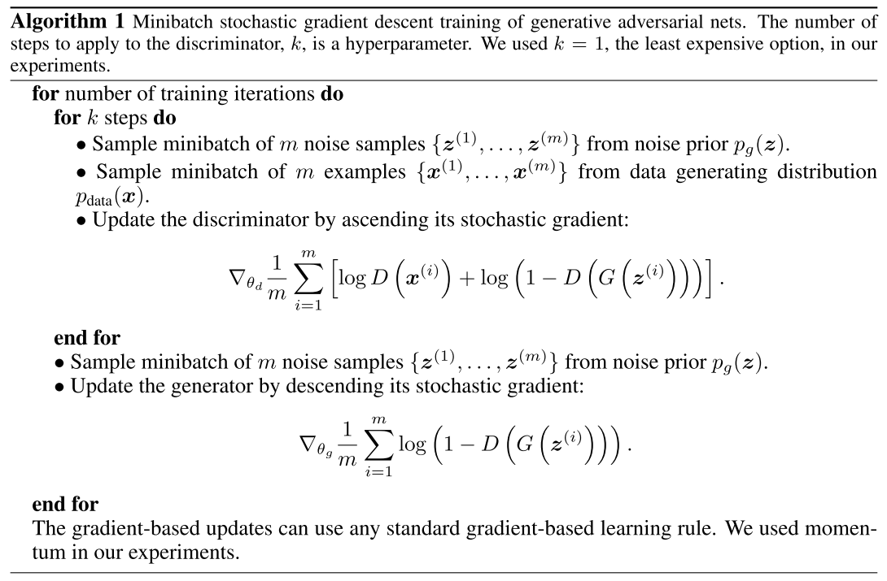

# GAN

[AdversarialNetsPapersList](https://github.com/zhangqianhui/AdversarialNetsPapers#adversarialnetspapers)

## Generative Adversarial Nets 

> Ian J. Goodfellow. University of Montreal, 2014.  
> [http://www.github.com/goodfeli/adversarial](http://www.github.com/goodfeli/adversarial)  
>   
> adversarial : adversarial relationship, conflict or opposition.  
> qualitative and quantitative : 定性与定量研究;  corpora or corpus, A collection of written texts, especially the entire works of a particular author or a body of writing on a particular subject.; intractable, hard to control or deal with; 
>
> How could I combine GAN with RL?   
> Is it possible for adding attention in GAN in image processing tasks?

1. simultaneously train two models: a **generative model** **G** that captures the data distribution; and a **discriminative model** **D** estimates the probability that a sample came from the training data rather than G. G's goal: maximise the probability of D making a mistake. A **unique solution** in the space of arbitrary functions G and D exists, with G recovering the training data distribution and D equal to 1/2 everywhere.
2. generator's distribution $$p_g$$ ; data $$x$$ ; input noise variables $$p_z(z)$$ ; mapping to data space: $$G(z;\theta_g)$$ , $$G$$ is a differentiable function; second multilayer perceptron $$D(x;\theta_d)$$ outputs a single scalar which is probability that $$x$$ came from the data rather than $$p_g$$.  $$D$$  maximizes the probability of assigning the correct label. we simultaneously train $$G$$ to minimize $$log(1-D(G(z)))$$ ;
3. Value function: $$\min_G \max_D V(D,G)=E_{x\sim p_{data}(x)}[\log D(x)] + E_{z\sim p_z(z)}[\log(1-D(G(z)))]$$   $$D(x)\rightarrow 1, D:make D[G(z)]\rightarrow 0; G: make D[G(z)]\rightarrow 1$$ 
4. Optimal discriminator D is  $$D_G^\ast (x) = \frac {p_{data}(x) }{p_{data}(x)+p_g(x)}$$  it means, p\_g will be much similar to P\_data in the training period.
5. Experiments: trains the nets on datasets: MNIST, Toronto Face Database TFD,
6. pseudocode

GAN 的优点：  
（以下部分摘自ian goodfellow 在Quora的问答）  
●  GAN是一种生成式模型，相比较其他生成模型（玻尔兹曼机和GSNs）只用到了反向传播,而不需要复杂的马尔科夫链  
●  相比其他所有模型, GAN可以产生更加清晰，真实的样本  
●  GAN采用的是一种无监督的学习方式训练，可以被广泛用在无监督学习和半监督学习领域  
●  相比于变分自编码器, GANs没有引入任何决定性偏置\( deterministic bias\),变分方法引入决定性偏置,因为他们优化对数似然的下界,而不是似然度本身,这看起来导致了VAEs生成的实例比GANs更模糊  
●  相比VAE, GANs没有变分下界,如果鉴别器训练良好,那么生成器可以完美的学习到训练样本的分布.换句话说,GANs是渐进一致的,但是VAE是有偏差的  
●  GAN应用到一些场景上，比如图片风格迁移，超分辨率，图像补全，去噪，避免了损失函数设计的困难，不管三七二十一，只要有一个的基准，直接上判别器，剩下的就交给对抗训练了。  
  
 GAN的缺点：  
●  训练GAN需要达到纳什均衡,有时候可以用梯度下降法做到,有时候做不到.我们还没有找到很好的达到纳什均衡的方法,所以训练GAN相比VAE或者PixelRNN是不稳定的,但我认为在实践中它还是比训练玻尔兹曼机稳定的多  
●  GAN不适合处理离散形式的数据，比如文本  
●  GAN存在训练不稳定、梯度消失、模式崩溃的问题（目前已解决）  
  
模式崩溃\(model collapse\)原因

一般出现在GAN训练不稳定的时候，具体表现为生成出来的结果非常差，但是即使加长训练时间后也无法得到很好的改善。

具体原因可以解释如下：GAN采用的是对抗训练的方式，G的梯度更新来自D，所以G生成的好不好，得看D怎么说。具体就是G生成一个样本，交给D去评判，D会输出生成的假样本是真样本的概率（0-1），相当于告诉G生成的样本有多大的真实性，G就会根据这个反馈不断改善自己，提高D输出的概率值。但是如果某一次G生成的样本可能并不是很真实，但是D给出了正确的评价，或者是G生成的结果中一些特征得到了D的认可，这时候G就会认为我输出的正确的，那么接下来我就这样输出肯定D还会给出比较高的评价，实际上G生成的并不怎么样，但是他们两个就这样自我欺骗下去了，导致最终生成结果缺失一些信息，特征不全。

关于梯度消失的问题可以参考郑华滨的令人拍案叫绝的wassertein GAN，里面给出了详细的解释，不过多重复。

**为什么GAN中的优化器不常用SGD**

1. SGD容易震荡，容易使GAN训练不稳定，

2. GAN的目的是在高维非凸的参数空间中找到纳什均衡点，GAN的纳什均衡点是一个鞍点，但是SGD只会找到局部极小值，因为SGD解决的是一个寻找最小值的问题，GAN是一个博弈问题。

**为什么GAN不适合处理文本数据**

1. 文本数据相比较图片数据来说是离散的，因为对于文本来说，通常需要将一个词映射为一个高维的向量，最终预测的输出是一个one-hot向量，假设softmax的输出是（0.2， 0.3， 0.1，0.2，0.15，0.05）那么变为onehot是（0，1，0，0，0，0），如果softmax输出是（0.2， 0.25， 0.2， 0.1，0.15，0.1 ），one-hot仍然是（0， 1， 0， 0， 0， 0），所以对于生成器来说，G输出了不同的结果但是D给出了同样的判别结果，并不能将梯度更新信息很好的传递到G中去，所以D最终输出的判别没有意义。

2. 另外就是GAN的损失函数是JS散度，JS散度不适合衡量不想交分布之间的距离。

（WGAN虽然使用wassertein距离代替了JS散度，但是在生成文本上能力还是有限，GAN在生成文本上的应用有seq-GAN,和强化学习结合的产物）

**训练GAN的一些技巧**

1. 输入规范化到（-1，1）之间，最后一层的激活函数使用tanh（BEGAN除外）  
2. 使用wassertein GAN的损失函数，  
3. 如果有标签数据的话，尽量使用标签，也有人提出使用反转标签效果很好，另外使用标签平滑，单边标签平滑或者双边标签平滑  
4. 使用mini-batch norm， 如果不用batch norm 可以使用instance norm 或者weight norm  
5. 避免使用RELU和pooling层，减少稀疏梯度的可能性，可以使用leakrelu激活函数6. 优化器尽量选择ADAM，学习率不要设置太大，初始1e-4可以参考，另外可以随着训练进行不断缩小学习率，  
7. 给D的网络层增加高斯噪声，相当于是一种正则.

**GAN的变种**

自从GAN出世后，得到了广泛研究，先后几百篇不同的GANpaper横空出世，国外有大神整理了一个GAN zoo（GAN动物园），链接如下，感兴趣的可以参考一下：[https://github.com/hindupuravinash/the-gan-zoo](https://github.com/hindupuravinash/the-gan-zoo)  
GitHub上已经1200+star了，顺便附上一张GAN的成果图，可见GAN的研究火热程度：

由于GAN的变种实在太多，这里我只简单介绍几种比较常常用的成果，包括DCGAN,, WGAN, improved-WGAN，BEGAN，并附有详细的代码github链接。

  
**GAN的广泛应用**

1. GAN本身是一种生成式模型，所以在数据生成上用的是最普遍的，最常见的是图片生成，常用的有DCGAN WGAN，BEGAN，个人感觉在BEGAN的效果最好而且最简单。  
2. GAN本身也是一种无监督学习的典范，因此它在无监督学习，半监督学习领域都有广泛的应用，比较好的论文有

Improved Techniques for Training GANs  
Bayesian GAN（最新）  
Good Semi-supervised Learning

3. 不仅在生成领域，GAN在分类领域也占有一席之地，简单来说，就是替换判别器为一个分类器，做多分类任务，而生成器仍然做生成任务，辅助分类器训练。  
4. **GAN可以和强化学习结合，目前一个比较好的例子就是seq-GAN**  
5. 目前比较有意思的应用就是GAN用在图像风格迁移，图像降噪修复，图像超分辨率了，都有比较好的结果，详见pix-2-pix GAN 和cycle GAN。但是GAN目前在视频生成上和预测上还不是很好。  
6. 目前也有研究者将GAN用在对抗性攻击上，具体就是训练GAN生成对抗文本，有针对或者无针对的欺骗分类器或者检测系统等等，但是目前没有见到很典范的文章。

_一个网友分享的训练总结:_

下面谈一谈我训练GAN的感受，GAN是在是太难训练了，即使是使用WGAN，WGAN-GP，还是遇到了训练困难的问题，以上这些结果都是我做了好几次实验得出来的结果，有些实验中间得到的生成结果其实是惨不忍睹的，就像是下面这样，我总结了一部分原因，一个原因是网络结构太简单，我本次使用的网络是几年前流行的DCGAN的网络结构，有很大的改进空间，现在基本上用的不多了，我也试了BEGAN，不得不说BEGAN是真好训练，只要写好代码就让他自己跑去吧，基本上不会出问题，而且效果还很好；另一个原因是优化器的选择和学习率等超参数的设置。设置好的超参数对GAN的训练是很有帮助的，至于优化器，尽量不要选择SGD，因为GAN的平衡点是一个鞍点，鞍点附近梯度几乎为0，使用梯度的优化方法很难收敛到最优点，另外就是SGD训练震荡，很容易引起训练不稳定。理论上是这样，实际的问题比这复杂的多。

## NAN

## NAN

## NAN

##  

